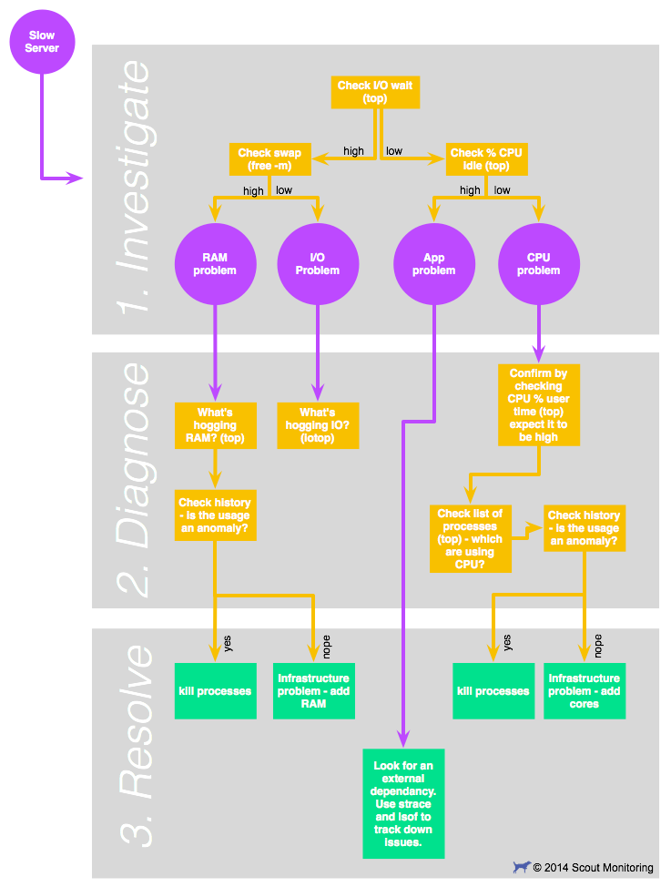

# Exercise 2

Contains app.py entry point for ssh,commands for remote server,create number of files on remote server, zip it,download it to local and extract


## Installation

Install the requirements.txt
Note: assuming you have connect DB in exercise1/setting.py DATABASES variable.
```bash
  pip install requirements.txt
  python app.py
```
supply parameters as inputs


## 3. Apache Restart
    I have added apache_restart.sh file

## 4. How to monitor a server for performance, what are the methods, how many ways it can be done?
### a. write commands to troubleshoot
command
```bash
    top
```
        use top - look for "wa" (I/O wait) and "id" (CPU idletime)
        checking I/O wait is the best initial step to narrow down the root cause of 
            server slowness. If I/O wait is low, you can rule out disk access in your diagnosis.
        I/O Wait represents the amount of time the CPU waiting for disk or network I/O. Waiting is the key here 
            - if your CPU is waiting, it's not doing useful work. It's like a chef who can't serve a 
            meal until he gets a delivery of ingredients. Anything above 10% I/O wait should be 
            considered high.

        On the other hand, CPU idle time is a metric you WANT to be high -- 
            the higher this is, the more bandwidth your server has to handle whatever else you 
            throw at it. If your idle time is consistently above 25%, consider it 
            "high enough"
### b. write commands to identify which process are consuming more load on server.
command
```bash
    top
    free -m
```    
     IO wait is low and idle time is high means slowness isn't due to CPU or IO 
     problems, so it's likely an application-specific issue. It's also possible that 
     the slowness is being caused by another server in your cluster, or by an external service 
     you rely on
### c. write commands to minimize the server load (Loaded slow apache services)
  command
```bash
    top
    free -m
    iotop
```    
swap usage is high - it means that you are actually out of RAM. and 
swap usage is low - it means you have a "real" IO wait problem.
use top. Once top is running, press the M key - this will sort applications by the memory used.
-   if memory usage seems anomalous: kill the offending processes.
-   if memory usage seems business-as-usual: add RAM to the server, or split high-memory using services to other servers.
## Screenshots




## 5. Create a view from query
```bash
    CREATE VIEW view_name AS
    SELECT column1, column2, ...
    FROM table_name
    WHERE condition;
```
## 6. Insert 10 or more values in the table
```bash
    INSERT INTO `listing_router` (`id`, `sap_id`, `hostname`, `loopback`, `mac_address`, `created_at`, `deleted_at`, `updated_at`) VALUES
        (1, '8/6/12:1', 'zyfhdrjhjg', '127.152.206.66', '02:00:00:23:6a:e7', '2022-04-28 06:23:19.157686', '2022-04-28 08:53:39.559056', '2022-04-28 08:53:39.560056'),
        (2, '5/8/12:1', 'yprxcixsnj', '127.181.55.124', '02:00:00:65:10:0c', '2022-04-28 06:23:19.162683', '2022-04-28 08:52:36.286519', '2022-04-28 08:52:36.286519'),
        (3, '2/6/3:1', 'kknoucpjnkrd', '127.205.194.116', '02:00:00:d2:c0:5e', '2022-04-28 06:23:19.166685', NULL, '2022-04-28 06:23:19.166685'),
        (4, '2/7/11:1', 'ebmj', '127.171.196.93', '02:00:00:06:3c:0d', '2022-04-28 06:23:19.169685', NULL, '2022-04-28 06:23:19.169685'),
        (5, '9/7/6:1', 'wcbuqvw', '127.175.121.59', '02:00:00:c6:96:23', '2022-04-28 06:23:19.173685', NULL, '2022-04-28 06:23:19.173685'),
        (6, '3/3/6:1', 'vtukerzft', '127.67.193.239', '02:00:00:09:cc:36', '2022-04-28 06:23:19.178693', NULL, '2022-04-28 06:23:19.178693'),
        (7, '2/7/9:1', 'zmp', '127.220.22.16', '02:00:00:33:d8:c1', '2022-04-28 06:23:19.181681', NULL, '2022-04-28 06:23:19.182685'),
        (8, '4/5/2:1', 'odhsrmjqph', '127.67.33.135', '02:00:00:4d:77:25', '2022-04-28 06:23:19.185684', NULL, '2022-04-28 06:23:19.185684'),
        (9, '3/7/6:1', 'gnpruxgma', '127.240.254.163', '02:00:00:8f:fa:41', '2022-04-28 06:23:19.188682', NULL, '2022-04-28 06:23:19.188682'),
        (10, '2/4/6:1', 'vkimyxeomdluv', '127.255.107.81', '02:00:00:d0:f7:05', '2022-04-28 06:23:19.193684', NULL, '2022-04-28 06:23:19.194689')
```
